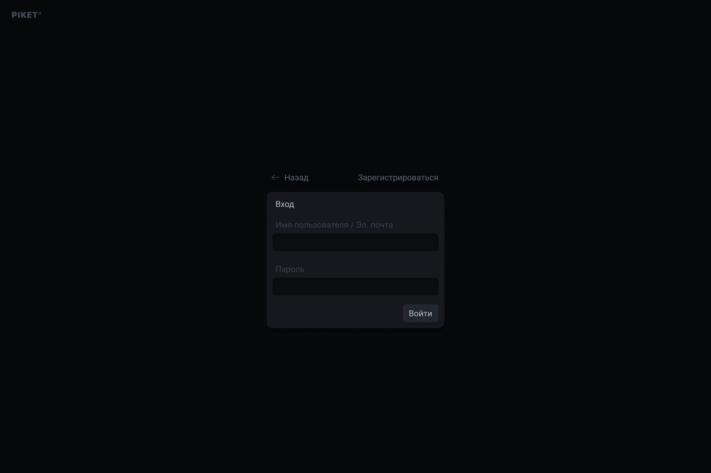

# Спецификация формы входа (авторизация)

## Назначение экрана

Экран входа предназначен для авторизации существующих пользователей в системе Piket.pro. Пользователь вводит свои учётные данные (имя пользователя или электронную почту и пароль) и получает доступ к личному кабинету и функционалу системы.

## Поля и правила валидации

| Поле                          | Тип данных | Обязательность | Ограничения и проверки                                                               |
|------------------------------|-----------|---------------|--------------------------------------------------------------------------------------|
| **Имя пользователя / E‑mail** | Строка     | Да            | Принимает либо имя пользователя, либо адрес электронной почты; без пробелов; 3–50 символов; проверяется на существование в базе. |
| **Пароль**                    | Пароль     | Да            | 8–32 символа; допускает буквы, цифры, спецсимволы; скрытый ввод; пароль валидируется только на наличие ввода (сложность проверялась при регистрации). |

## Обработка события «Войти»

1. **Проверка обязательных полей.** Перед отправкой система убеждается, что оба поля заполнены. Если одно из полей пустое, под ним выводится сообщение «Поле обязательно для заполнения».
2. **Отправка на сервер.** При заполненных полях форма отправляет данные на сервер по защищённому протоколу HTTPS. Сервер проверяет, что учётная запись существует и пароль корректный.
3. **Ответ сервера.** 
   - При успешной авторизации пользователь перенаправляется на главную страницу (Dashboard) или на страницу, с которой пришёл.
   - При ошибке выводится сообщение: «Неверное имя пользователя/email или пароль».

## Навигация и интерфейсные элементы

- **Ссылка «← Назад».** Возвращает пользователя на предыдущую страницу или на лендинг сайта.
- **Ссылка «Зарегистрироваться».** Перенаправляет на форму регистрации для создания нового аккаунта.
- **Кнопка «Войти».** Активна только при заполнении обоих полей. 
- **(Опционально) Ссылка «Забыли пароль?».** Можно добавить для восстановления доступа; она открывает форму ввода email и отправки инструкции по восстановлению.

## Дополнительные требования

- **Безопасность.** Данные передаются только по HTTPS; пароль не сохраняется в локальном хранилище. При трёх неуспешных попытках подряд возможна задержка (2–5 секунд), чтобы защититься от перебора.
- **Адаптивность и доступность.** Форма корректно отображается на мобильных и десктопных устройствах; элементы имеют ярко выраженный фокус для клавиатурной навигации; контраст соответствует WCAG 2.1 AA.
- **Ролевая модель.** После успешного входа сервер возвращает информацию о роли пользователя (директор, инженер, мастер и т.д.), что влияет на доступный функционал. Это должно быть отражено в общей бизнес‑логике системы.

Эта спецификация дополняет общий раздел требований и используется при разработке и тестировании модуля авторизации.
